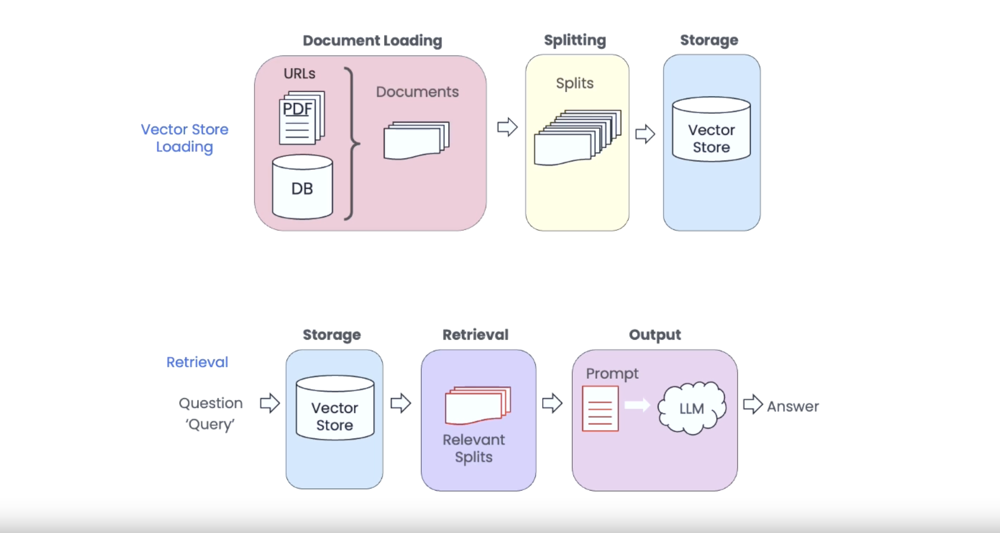

# Generative AI

Traditionally, AI has been used to analyze data, identify patterns and make predictions based on existing data. The recent advancements have led to AI becoming better at generating new things (rather than just analyzing existing things). This is referred to as `Generative AI`. Generative AI is powered mainly by machine learning models called Large Language Models (LLM). LLMs are pre-trained on large quantities of publicly available text. There are various proprietary LLMs from companies like `OpenAI`, `Cohere`, `AI21`, as well as a lot of emerging open-source LLMs like `Llama`, `Dolly`, etc.

Generative AI refers to a class of artificial intelligence models designed to create new data by learning patterns and structures from existing data.

Generative AI models are built by training on a large dataset of general examples (such as wikipedia, commoncrawl, etc) and then using that knowledge to generate new examples that are similar to the training data. So the idea is to generate new data. A generative AI model that is trained on a dataset of images of cats may be able to generate new images of cats that are similar to the training data.

## Life Cycle of Generative AI Models

🔹 Data collection (web scraping, APIs, etc.)
🔹 Pre-processing (cleaning, tokenization, etc.)
🔹 Model training (unsupervised learning, transfer learning)
🔹 Fine-tuning (supervised learning, specialized datasets)
🔹 Deployment (APIs, applications)
🔹 Maintenance (updates, improvements)

## Predictive AI and Generative AI

Generative AI and predictive AI are two different types of artificial intelligence (AI) that are used for different purposes

Predictive AI is used to predict future events based on past data. Generative AI is used to create new data based on patterns and structures learned from existing data.

## Embeddings (Numerical Vector)

Turning Words, Images and Videos into Numbers

Embeddings are techniques that convert complex data, such as words, into simpler numerical representations (called vectors). This makes it easier for AI systems to understand and work with the data.

## Transformers

Transformers are a type of `neural network architecture` that underlies models like GPT-3, leveraging self-attention mechanisms to process and generate text efficiently and effectively

Transformer-based models can process input tokens in parallel, making them more scalable and capable of handling long-range dependencies in the text.

Transformers are especially good at understanding the structure of language and how words relate to each other, which makes them well-suited for tasks like text generation, translation, and summarization.

## Transfer learning

Transfer learning is a machine learning technique in which a model is trained on one task and then used to perform another task.

The idea is that the knowledge and representations learned by the model from the source task can be transferred to the target task, helping the model generalize better and achieve better performance, especially when the target task has limited data.

### Fine Tuning

Fine-tuning is one of the ways to implement `transfer learning`.

Fine-tuning is a process in which a pre-trained model is adapted to a new domain or task.

Fine-tuning is a common approach to transfer learning, where knowledge gained from training a model on one task is used to improve generalization on another task.

### Supervised Fine-Tuning (SFT)

    `SFT` is a type of fine-tuning that uses labeled data to train the LLM. The labeled data consists of pairs of input and output data. The input data is the data that the LLM will be given, and the output data is the data that the LLM is expected to generate. SFT is a relatively simple and efficient way to fine-tune an LLM.

### Reinforcement Learning from Human Feedback (RLHF)

    `RLHF` is a type of fine-tuning that uses human feedback to train the LLM. Human feedback can be collected in a variety of ways, such as through surveys, interviews, or user studies. RLHF is a more complex and time-consuming way to fine-tune an LLM, but it can be more effective than SFT.ur data.

## Retrieval Augmented Generation (RAG)

LLM's knowledge is restricted to its training set. So, suppose the model was trained on data up to 2021 and is asked about a company founded in 2023. In that case, it may generate a plausible but entirely fabricated description - a phenomenon known as `hallucination`.

Managing `hallucinations` is tricky, especially in applications where accuracy and reliability are paramount, such as customer-service chatbots, knowledge-base assistants, or AI tutors.

One promising strategy to mitigate `hallucination` is the use of `retrievers` in tandem with LLMs. A retriever fetches relevant information from a trusted knowledge base (Documents / Vector Store), and the LLM is then specifically prompted to rearrange the information without inventing additional details.

Efficient retrievers are built using embedding models that map texts to vectors. These vectors are then stored in specialized databases called vector stores.

Interaction between Retrieval Augmented Generation (RAG) and Large Language Models (LLM)

## OpenAI Rate Limits

The OpenAI API has separate limits for requests per minute and tokens per minute.

[Why rate limits exist & Default rate limits](https://github.com/openai/openai-cookbook/blob/main/examples/How_to_handle_rate_limits.ipynb)
