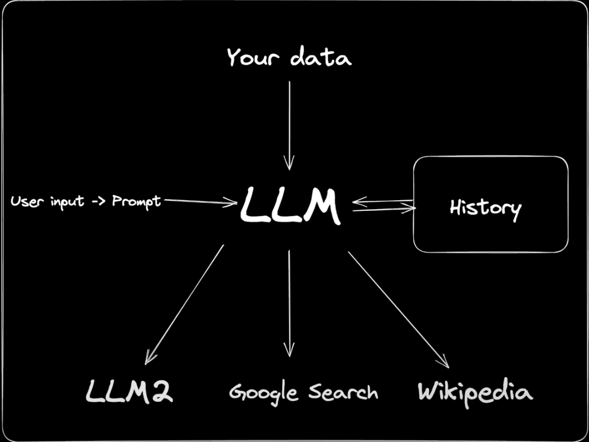
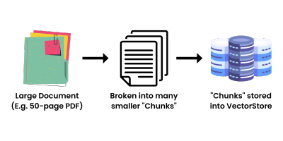
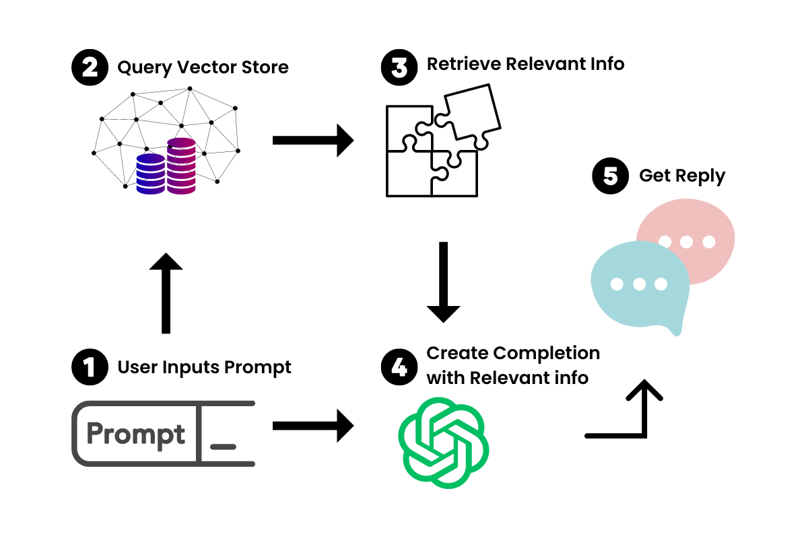

# LangChain

LangChain is a `framework` for developing applications powered by a language models.

It connects a language model to other sources of data

Imagine

- You want to build an application on top of ChatGPT or any other powerful language model.
- You want to connect it to other sources of data (like a database, PDF, Email),
- You also want to construct Prompts based on plain user inputs,
- You also want to store coverssational history,
- You also want to combine the model with other models
- Give access to Google Search or Wikipedia to make it even more powerful

LangChain makes all this whole lot easier. It allows building applications with LLMs through composability.



LangChain just composes large amounts of data that can easily be referenced by a LLM with as little computation power as possible. It works by taking a big source of data, take for example a 50-page PDF, and breaking it down into "chunks" which are then embedded into a Vector Store.



Now that we have vectorized representations of the large document, we can use this in conjunction with the LLM to retrieve only the information we need to be referenced when creating a prompt-completion pair.

When we insert a prompt into our new chatbot, LangChain will query the Vector Store for relevant information. Think of it as a mini-Google for your document. Once the relevant information is retrieved, we use that in conjunction with the prompt to feed to the LLM to generate our answer.



## Key Components / Modules

### Models / Model I/O (LLM Wrappers)

Generaic Interface for LLMs

You can access models form OpenAI, Cohere, HuggingFace and many more providers.

```python
# import schema for chat messages and ChatOpenAI in order to query chatmodels GPT-3.5-turbo or GPT-4

from langchain.schema import (
    AIMessage,
    HumanMessage,
    SystemMessage
)
from langchain.chat_models import ChatOpenAI


chat = ChatOpenAI(model_name="gpt-3.5-turbo",temperature=0.3)
messages = [
    SystemMessage(content="You are an expert data scientist"),
    HumanMessage(content="Write a Python script that trains a neural network on simulated data ")
]
response=chat(messages)

print(response.content,end='\n')
```

### Prompts

PromptTemplates that allow you to dynamically change the prompts with user input, similar to how regex are used

```python

# Import prompt and define PromptTemplate

from langchain import PromptTemplate

template = """
You are an expert data scientist with an expertise in building deep learning models.
Explain the concept of {concept} in a couple of lines
"""

prompt = PromptTemplate(
    input_variables=["concept"],
    template=template,
)


# Run LLM with PromptTemplate

llm(prompt.format(concept="autoencoder"))
llm(prompt.format(concept="regularization"))

```

### Chains

Sequence of Calls

Chains go beyond one LLM call and sequences of calls. For example you can chain together a prompt template and a LLM call.

```python

from langchain.models import GPT3Model
from langchain.prompts import PromptTemplate
from langchain.chains import Chain

model = GPT3Model("openai", "davinci")
template = PromptTemplate("What is the capital of {country}?")
chain = Chain([template, model])

chain.run({"country": "Germany"})
```

### Memory (Embeddings and Vector Stores)

Provides a Standard Interface for memory and memory implementations

You can easily store a message history of a Chatbot.

The idea behind embeddings and Vector Stores is to break large data into chunks and store those to be queried when relevant.

```python
from langchain.memory import ChatMessageHistory

history = ChatMessageHistory()

history.add("Hello")

history.add("How are you?")

history.get()
```

### Indexes

Utility functions to load your own text data and create indexes for it.
You can combine your own data with the data from the LLMs.
It provides Document Loaders for PDFs, Emails, and many more.

```python

from langchain.document_loaders import PyPDFLoader
from langchain.document_loaders import UnstructuredEMailLoader
from langchain.document_loaders import NotionDirectLoader

loader = NotionDirectLoader("https://www.notion.so/My-Notion-Page-123456789")
loader = PyPDFLoader("path/to/file.pdf")
loader = UnstructuredEMailLoader("path/to/file.eml")

loader.load()

```

It also provides Vector store interfaces to store and query vectors.

```python

from langchain.vector_stores import Pinecone

vector_store = Pinecone("my-pinecone-api-key")

vector_store.add("Hello World", [0.1, 0.2, 0.3])

vector_store.query([0.1, 0.2, 0.3])

```

### Agents and Tools

Setup agents that can use tools like Google Search, Wikipedia, and many more.

```python

from langchain.agents import GoogleSearchAgent

agent = GoogleSearchAgent()

agent.search("Hello World")

```
