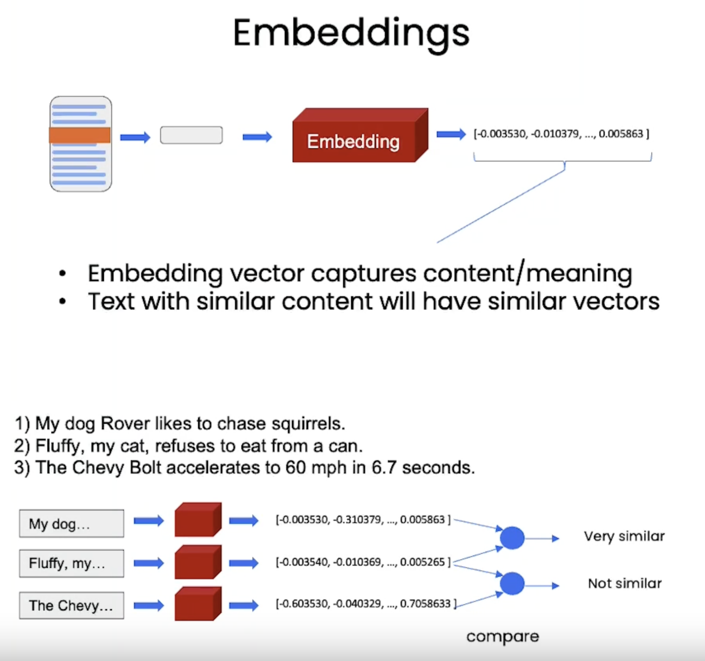
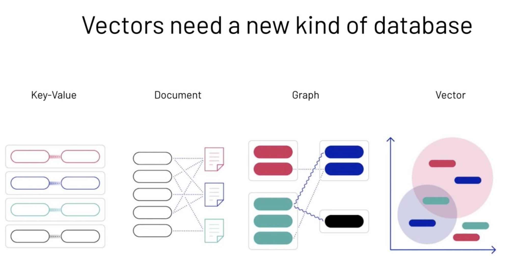
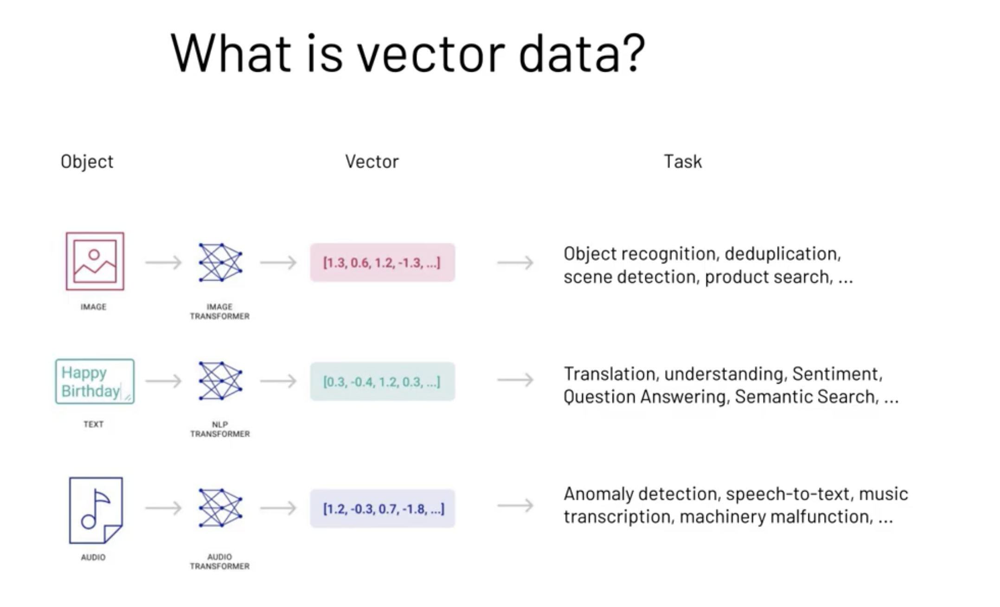
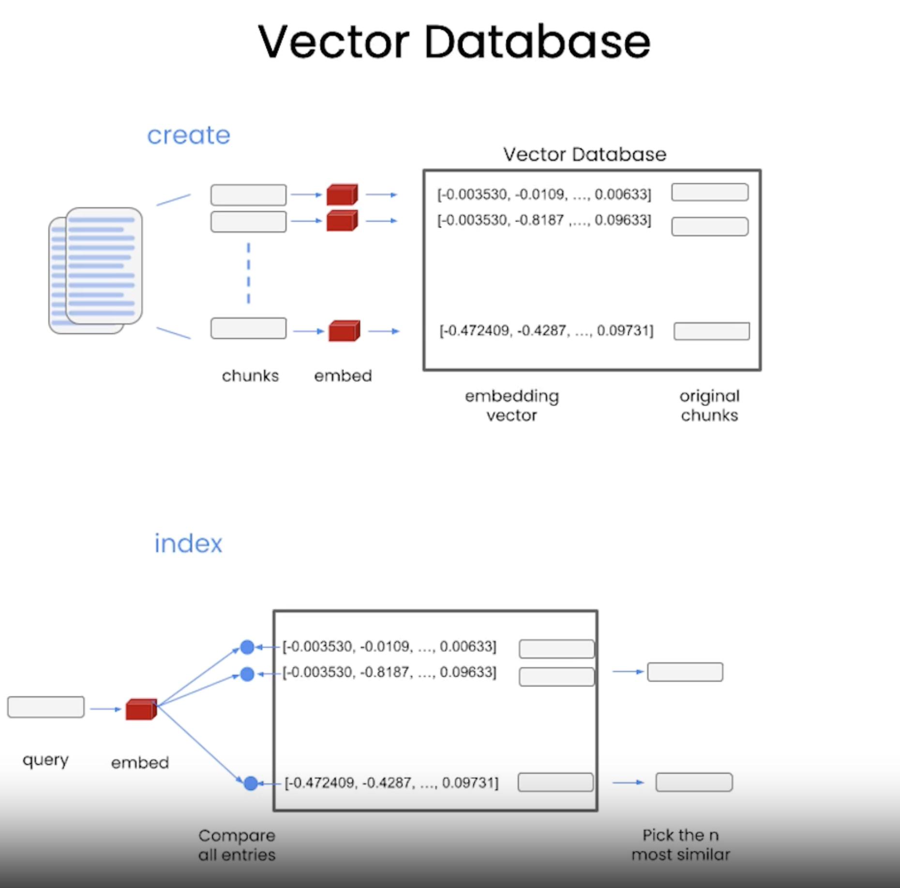

# Vector Stores

LLM's knowledge is restricted to its training set. Suppose the model was trained on data up to 2021 and is asked about a company founded in 2023. In that case, it may generate a plausible but entirely fabricated description - a phenomenon known as **hallucination**. Managing hallucinations is tricky, especially in applications where accuracy and reliability are paramount, such as customer-service chatbots, knowledge-base assistants, or AI tutors.

One promising strategy to mitigate hallucination is the use of **retrievers** in tandem with LLMs. A retriever fetches relevant information from a trusted knowledge base (like a search engine), and the LLM is then specifically prompted to rearrange the information without inventing additional details.

Efficient retrievers are built using **embedding** models that map texts to vectors. These vectors are then stored in specialized databases called vector stores.

## Embeddings

Embedding is just a vector, a list of numbers with a semantic meaning only understandable by the machine.

Turning Words, Images and Videos into Numbers.

Embeddings are techniques that convert complex data, such as words, into simpler numerical representations (called vectors). This makes it easier for AI systems to understand and work with the data.

To store documents as vectors, a vector database requires a process called `embedding` to convert each word into a vector of hundreds or thousands of `different dimensions`. For example, OpenAI `Ada` embedding results in over 1500 dimensions.

**Language models** can only inspect a few thousand words at a time. So if we have really large documents, how can we get the language model to answer questions about everything that's in there?

This is where **embeddings** and vector stores come into play.

**Embeddings** create numerical representations for pieces of text.

This numerical representation captures the **semantic meaning** of the piece of text that it's been run over.Pieces of text with **similar content** will have **similar vectors**.

In the example below, we can see that we have three sentences. The first two are about pets, while the third is about a car.If we look at the representation in the numeric space, we can see that when we compare the two vectors on the pieces of text corresponding to the sentences about pets, they're very similar.

While if we compare it to the one that talks about a car, they're not similar at all. This will let us easily figure out which pieces of text are like each other, which will be very useful as
we think about which pieces of text we want to include when passing to the language model to answer a question.

## Vector Databases

Vector databases store data such as text, video or images that are converted into vector `embeddings` for AI models to access them quickly. Vector databases are used in machine learning (ML) applications such as recommendation systems, search engines, and natural language processing (NLP).

Vector databases are different from traditional databases in that they store data in the form of vectors. Traditional databases store data in the form of table rows and columns. The vector database stores data in the form of vectors, which are lists of numbers represented as a sequence of numbers or as a single value in a row and a single value in the column section.

Although SQL and NoSQL databases might work for some ML use cases, vector databases are better suited for use cases involving text, search, recommendation, audio, and NLP. Vector databases are also better suited for use cases involving similarity search, which is a search technique that finds similar items based on their features.

A **vector database** is a way to store vector representations. The way that we create this vector database is we populate it with chunks of text coming from incoming documents. When we get a big incoming document, we're first going to break it up into smaller chunks. This helps create pieces of text that are smaller than the original document, which is useful because we may not be able to pass the whole document to the language model. So we want to create these small chunks
so we can only pass the most relevant ones to the language model. We then create an embedding for each of these chunks, and then we store those in a vector database.

### Vector DBs

https://www.pinecone.io/

https://github.com/chroma-core/chroma

https://github.com/weaviate/weaviate

https://weaviate.io/

https://github.com/activeloopai/deeplake

https://github.com/qdrant/qdrant

### Usecases

1. Long term memory for LLM (Language Model)

2. Semantic Search : Search based on meaning or context rather than on exact word matches.

3. Similarity Search for text, images, videos, audio, etc.

4. Recommendation (Ranking) Engines : Suggest the most relevant items to users based on their past purchases or preferences. Identifying the nearest neighbors of a given item in a vector database can help with this.

5. Anomaly Detection : Identify unusual patterns in data that do not conform to expected behavior.

## When do use Vector DBs

GPT is an incredibly powerful tool for natural language processing tasks. However, when it comes to customized tasks, its capacity can be limited by the input token size.

For example, GPT has a limited input size (4,096 for GPT3.5), but you have a very long text (e.g. a book) that you want to ask questions about. While fine-tuning GPT with your private data is a potential solution, it can be a complex and expensive process, requiring high computational power and expertise in machine learning.

Fortunately, there is an alternative solution that can enhance GPT’s performance without requiring any changes to the model itself: using an external vector database to store your data and letting GPT retrieve relevant data to answer your prompting questions.
